[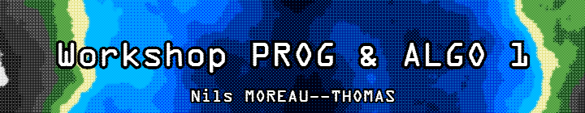](./images/banner.png)

- [Exos](#exos)
    - [⭐ Ne garder que le vert](#-ne-garder-que-le-vert)
    - [⭐ Échanger les canaux](#-échanger-les-canaux)
    - [⭐ Noir \& Blanc](#-noir--blanc)
    - [⭐ Négatif](#-négatif)
    - [⭐ Dégradé](#-dégradé)
    - [⭐⭐ Miroir](#-miroir)
    - [⭐⭐ Image bruitée](#-image-bruitée)
    - [⭐⭐ Rotation de 90°](#-rotation-de-90)
    - [⭐⭐ RGB split](#-rgb-split)
    - [⭐⭐ Luminosité](#-luminosité)
    - [⭐⭐(⭐) Disque](#-disque)
        - [⭐⭐⭐ Cercle](#-cercle)
        - [⭐⭐ Animation](#-animation)
        - [⭐⭐⭐ Rosace](#-rosace)
    - [⭐⭐ Mosaïque](#-mosaïque)
        - [⭐⭐⭐⭐ Mosaïque miroir](#-mosaïque-miroir)
    - [⭐⭐⭐ Glitch](#-glitch)
    - [⭐⭐⭐ Tri de pixels](#-tri-de-pixels)
    - [⭐⭐⭐(⭐) Fractale de Mandelbrot](#-fractale-de-mandelbrot)
    - [⭐⭐⭐(⭐) Dégradés dans l'espace de couleur Lab](#-dégradés-dans-lespace-de-couleur-lab)
    - [⭐⭐⭐(⭐) Tramage](#-tramage)
    - [⭐⭐⭐(⭐) Normalisation de l'histogramme](#-normalisation-de-lhistogramme)
    - [⭐⭐⭐⭐ Vortex](#-vortex)
    - [⭐⭐⭐⭐ Convolutions](#-convolutions)
        - [⭐ Netteté, Contours, etc.](#-netteté-contours-etc)
    - [⭐⭐ Filtres séparables](#-filtres-séparables)
    - [⭐⭐ Différence de gaussiennes](#-différence-de-gaussiennes)
    - [⭐⭐⭐⭐⭐ K-means : trouver les couleurs les plus présentes dans une image](#-k-means--trouver-les-couleurs-les-plus-présentes-dans-une-image)
    - [⭐⭐⭐⭐⭐ Filtre de Kuwahara (effet peinture à l'huile)](#-filtre-de-kuwahara-effet-peinture-à-lhuile)
    - [⭐⭐⭐⭐⭐⭐ Diamond Square](#-diamond-square)
        - [⭐⭐ Colorer la height map](#-colorer-la-height-map)
- [Custom](#custom)
    - [⭐ Différence](#-différence)
    - [⭐⭐ Animation Cercle Hachuré](#-animation-cercle-hachuré)
    - [⭐⭐⭐ Colorer la height map selon une image de dégradé](#-colorer-la-height-map-selon-une-image-de-dégradé)
        - [⭐⭐ Height map stylisée](#-height-map-stylisée)

# Exos

## ⭐ Ne garder que le vert

```cpp
#include <sil/sil.hpp>

int main()
{
    sil::Image image{"images/logo.png"};
    for (glm::vec3& color : image.pixels())
    {
        color.r = 0.f;
        color.b = 0.f;
    }
    image.save("output/keep_green_only.png");
}
```

[](./output/keep_green_only.png)

## ⭐ Échanger les canaux

```cpp
#include <sil/sil.hpp>

int main()
{
    sil::Image image{"images/logo.png"};
    for (glm::vec3& color : image.pixels())
    {
        std::swap(color.g, color.r);
        std::swap(color.b, color.g);
    }
    image.save("output/swap.png");
}
```

[](./output/swap.png)

## ⭐ Noir & Blanc

```cpp
#include <sil/sil.hpp>

int main()
{
    sil::Image image{"images/logo.png"};
    for (glm::vec3& color : image.pixels())
    {
        float c = color.r * 0.3 + color.g * 0.59 + color.b * 0.11;
        color = glm::vec3{c};
    }
    image.save("output/grayscale.png");
}
```

[](./output/grayscale.png)

## ⭐ Négatif

```cpp
#include <sil/sil.hpp>

int main()
{
    sil::Image image{"images/logo.png"};
    for (glm::vec3& color : image.pixels())
    {
        color.r = 1 - color.r;
        color.g = 1 - color.g;
        color.b = 1 - color.b;
    }
    image.save("output/negate.png");
}
```

[](./output/negate.png)

## ⭐ Dégradé

```cpp
#include <sil/sil.hpp>

int main()
{
    sil::Image image{300, 200};
    for (int x{0}; x < image.width(); ++x)
    {
        for (int y{0}; y < image.height(); ++y)
        {
            image.pixel(x, y) = glm::vec3{static_cast<float>(x) / static_cast<float>(image.width() - 1)};
        }
    }
    image.save("output/gradient.png");
}
```

[](./output/gradient.png)

## ⭐⭐ Miroir

```cpp
#include <sil/sil.hpp>

int main()
{
    sil::Image image{"images/logo.png"};
    for (int x{0}; x < image.width() / 2; ++x)
    {
        for (int y{0}; y < image.height(); ++y)
        {
            int mirrorX = image.width() - 1 - x;

            std::swap(image.pixel(x,y), image.pixel(mirrorX,y));
        }
    }
    image.save("output/mirror.png");
}
```

[](./output/mirror.png)

## ⭐⭐ Image bruitée

```cpp
#include <sil/sil.hpp>
#include "random.hpp"

int main()
{
    set_random_seed(0);

    sil::Image image{"images/logo.png"};
    for (int x{0}; x < image.width(); ++x)
    {
        for (int y{0}; y < image.height(); ++y)
        {
            image.pixel(x, y) = random_float(0.0f, 1.0f) < 0.5f ?
                glm::vec3(random_float(0.0f, 1.0f), random_float(0.0f, 1.0f), random_float(0.0f, 1.0f)) : image.pixel(x, y);
        }
    }
    image.save("output/noise.png");
}
```

[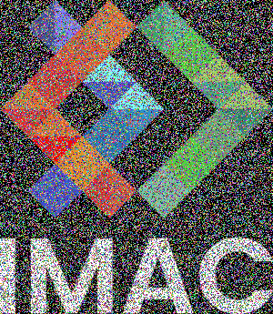](./output/noise.png)

## ⭐⭐ Rotation de 90°

```cpp
#include <sil/sil.hpp>

int main()
{
    sil::Image image{"images/logo.png"};
    sil::Image rotated_image{image.height(), image.width()};
    for (int x{0}; x < image.width(); ++x)
    {
        for (int y{0}; y < image.height(); ++y)
        {
            rotated_image.pixel(image.height() - 1 - y, x) = image.pixel(x, y);
        }
    }
    rotated_image.save("output/rotated.png");
}
```

[](./output/rotated.png)

## ⭐⭐ RGB split

```cpp
#include <sil/sil.hpp>

int main()
{
    sil::Image image{"images/logo.png"};
    sil::Image split_image{image.width(), image.height()};

    int offset = 20;

    for (int x{0}; x < image.width(); ++x)
    {
        for (int y{0}; y < image.height(); ++y)
        {

            split_image.pixel(x, y) = image.pixel(x, y);


            split_image.pixel(x, y).r = x-offset >= 0 ?
                image.pixel(x - offset, y).r : 0.0f;

            split_image.pixel(x, y).g = x+offset < image.width() ?
                image.pixel(x + offset, y).g : 0.0f;
        }
    }
    split_image.save("output/split.png");
}
```

[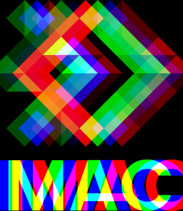](./output/split.png)

## ⭐⭐ Luminosité

```cpp
#include <sil/sil.hpp>
#include <cmath>

int main()
{
    sil::Image image{"images/photo.jpg"};
    double a = 0.8; // choose 0..5 (0.5 brightens, 2 darkens)
    for (glm::vec3& color : image.pixels()) {
        color.r = std::pow(color.r, a);
        color.g = std::pow(color.g, a);
        color.b = std::pow(color.b, a);
        color = glm::clamp(color, glm::vec3{0.0f}, glm::vec3{1.0f});
    }

    image.save("output/brightness.png")
}
```

[](./output/brightness.png)

## ⭐⭐(⭐) Disque

```cpp
#include <sil/sil.hpp>
/* https://fr.wikipedia.org/wiki/Disque_(g%C3%A9om%C3%A9trie) */

int main()
{
    sil::Image image{500/*width*/, 500/*height*/};

    int a = image.width() / 2;
    int b = image.height() / 2;

    int r = 100;

    for (int x{0}; x < image.width(); ++x)
    {
        for (int y{0}; y < image.height(); ++y)
        {
            int dx = x - a;
            int dy = y - b;
            if (dx*dx + dy*dy <= r * r) {
                image.pixel(x,y) = glm::vec3 {1.0f,1.0f,1.0f};
            }
        }
    }
    image.save("output/disc.png");
}
```

[](./output/disc.png)

### ⭐⭐⭐ Cercle

```cpp
#include <sil/sil.hpp>
#include <cmath>

int main()
{
    sil::Image image{500, 500};

    int a = image.width() / 2;
    int b = image.height() / 2;

    int r = 100;
    int thickness = 5; // thickness in pixels

    for (int x = 0; x < image.width(); ++x)
    {
        for (int y = 0; y < image.height(); ++y)
        {
            int dx = x - a;
            int dy = y - b;

            float dist = std::sqrt(dx * dx + dy * dy);

            if (std::abs(dist - r) <= thickness)
            {
                image.pixel(x, y) = glm::vec3{1.f, 1.f, 1.f};
            }
        }
    }

    image.save("output/circle.png");
}
```

[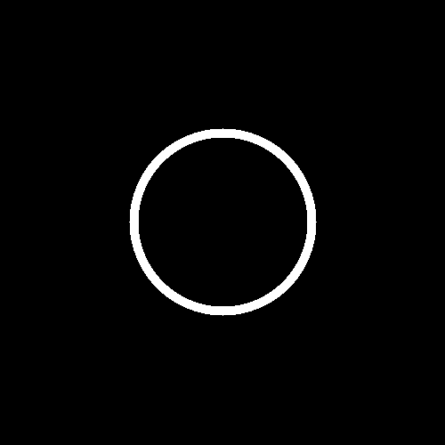](./output/circle.png)

### ⭐⭐ Animation

```cpp
#include <sil/sil.hpp>
#include <cmath>
#include <string>

int main()
{
    int r = 100;
    int spf = 10; // speed per frame

    for (int a = 0; a < 500; a+=spf) {

        sil::Image image{500, 500};
        int b = image.height() / 2;

        for (int x{0}; x < image.width(); ++x)
        {
            for (int y{0}; y < image.height(); ++y)
            {
                int dx = x - a;
                int dy = y - b;
                if (dx*dx + dy*dy <= r * r) {
                    image.pixel(x,y) = glm::vec3 {1.0f,1.0f,1.0f};
                }
            }
        }

        auto fileName = "output/animated_circle/" + std::to_string(a/spf) + ".png";
        image.save(fileName);
    }
}
```

[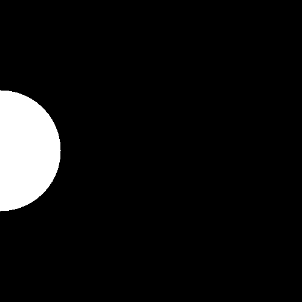](./output/animated_circle/ezgif.gif)

### ⭐⭐⭐ Rosace

```cpp
#include <sil/sil.hpp>
#include <cmath>

int main()
{
    sil::Image image{500, 500};

    int ca = image.width() / 2;
    int cb = image.height() / 2;

    int r = 100;
    int thickness = 5; // thickness in pixels
    int n = 6; //number of circles

    for (int i = 0; i < n; ++i)
    {
        float angle = i * (2 * std::numbers::pi_v<float> / n);
        int a = static_cast<int>(ca + r * std::cos(angle));
        int b = static_cast<int>(cb + r * std::sin(angle));

        for (int x = 0; x < image.width(); ++x)
        {
            for (int y = 0; y < image.height(); ++y)
            {
                int dx = x - a;
                int dy = y - b;

                float dist = std::sqrt(dx * dx + dy * dy);

                if (std::abs(dist - r) <= thickness)
                {
                    image.pixel(x, y) = glm::vec3{1.f, 1.f, 1.f};
                }
            }
        }
    }


    image.save("output/rosace.png");
}
```

[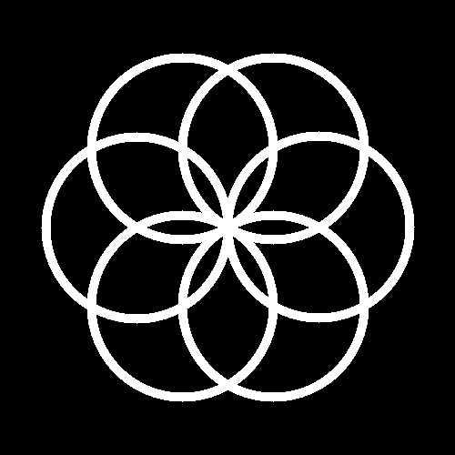](./output/rosace.png)

## ⭐⭐ Mosaïque

```cpp
#include <sil/sil.hpp>

int main()
{
    sil::Image base{"images/logo.png"};

    int n = 5;

    sil::Image image{base.width() * n, base.height() * n};

    for (int x{0}; x < (image.width()); ++x)
    {
        for (int y{0}; y < (image.height()); ++y)
        {
            image.pixel(x,y) = base.pixel(x % base.width(),y % base.height());
        }
    }
    image.save("output/mosaic.png");
}
```

[](./output/mosaic.png)

### ⭐⭐⭐⭐ Mosaïque miroir

```cpp
#include <sil/sil.hpp>

int main()
{
    sil::Image base{"images/logo.png"};
    int n = 5;
    sil::Image image{base.width() * n, base.height() * n};

    for (int x = 0; x < image.width(); ++x)
    {
        for (int y = 0; y < image.height(); ++y)
        {
            int tileX = x / base.width();
            int tileY = y / base.height();

            int localX = x % base.width();
            int localY = y % base.height();

            if (tileX % 2 != 0)
                localX = base.width() - 1 - localX;

            if (tileY % 2 != 0)
                localY = base.height() - 1 - localY;

            image.pixel(x, y) = base.pixel(localX, localY);
        }
    }

    image.save("output/mosaic_mirror.png");
}
```

[](./output/mosaic_mirror.png)

## ⭐⭐⭐ Glitch

```cpp
#include <sil/sil.hpp>
#include "random.hpp"

int main()
{
    set_random_seed(0);
    sil::Image image{"images/logo.png"};

    int n = 250; //number of glitch (the more the messier)
    int min_size_x = 10;
    int min_size_y = 5;
    int max_size_x = 20;
    int max_size_y = 10;

    for (int i = 0; i < n; ++i)
    {
        //rectangle
        glm::vec2 rectangle{
            random_int(min_size_x, max_size_x),
            random_int(min_size_y, max_size_y)
        };
        //where is r1
        glm::vec2 pos_r1{
            random_int(0, image.width() - rectangle.x - 1),
            random_int(0, image.height() - rectangle.y - 1)
        };

        //where is r2
        glm::vec2 pos_r2{
            random_int(0, image.width() - rectangle.x - 1),
            random_int(0, image.height() - rectangle.y - 1)
        };

        //swap on image based on base
        for (int x{0}; x < (image.width()); ++x)
        {
            for (int y{0}; y < (image.height()); ++y)
            {
                //if in r1 --> swap with equivalent in r2
                if (x >= pos_r1.x && x < pos_r1.x + rectangle.x && y >= pos_r1.y && y < pos_r1.y + rectangle.y)
                {

                    int sample_x = glm::clamp(static_cast<int>(pos_r2.x) + x, 0, image.width() - 1);
                    int sample_y = glm::clamp(static_cast<int>(pos_r2.y) + y, 0, image.height() - 1);


                    std::swap(image.pixel(x,y),image.pixel(sample_x,sample_y));
                }
            }
        }
    }

    image.save("output/glitch.png");
}
```

[](./output/glitch.png)

## ⭐⭐⭐ Tri de pixels

```cpp
#include <sil/sil.hpp>
#include <algorithm>

int main()
{
    sil::Image image{"images/logo.png"};

    //lambda exp that turn color into grayscale
    auto grayscale = [](const glm::vec3 &c){
        return glm::dot(c, glm::vec3{0.3f, 0.59f, 0.11f});
    };

    //sort each column by luminance
    for (int x{0}; x < image.width(); ++x)
    {
        //get column
        std::vector<glm::vec3> column;

        //append pixels to column
        for (int y{0}; y < image.height(); ++y)
            column.push_back(image.pixel(x, y));

        //sort column by luminance (worse up, better down)
        std::sort(column.begin(), column.end(), [&](const glm::vec3 &a, const glm::vec3 &b){
            return grayscale(a) > grayscale(b);
        });

        //write back in the image
        for (int y{0}; y < image.height(); ++y)
            image.pixel(x, y) = column[y];
    }

    image.save("output/sorted.png");
}
```

[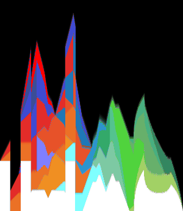](./output/sorted.png)

## ⭐⭐⭐(⭐) Fractale de Mandelbrot

```cpp
#include <sil/sil.hpp>
#include <complex>
#include <cmath>
#include <iostream>

int main() {
    int size = 500;

    sil::Image image{size, size};

    float maxIter = 40.f;
    float range = 4.f;
    float shift = 2.f;

    for (int x = 0; x < size; ++x) {
        for (int y = 0; y < size; ++y) {

            float cx = ((float)x / size) * range - shift; //[0;1] -> [0;4] -> [-2;2]
            float cy = ((float)y / size) * range - shift; //[0;1] -> [0;4] -> [-2;2]

            std::complex<float> c{
                cx,
                cy
            }; //c

            std::complex<float> z{0.f, 0.f}; //z = 0

            float iter = 0.f;
            while (std::abs(z) <= 2 && iter < maxIter) {
                z = z * z + c;
                ++iter;
            }

            image.pixel(x,y) = glm::vec3{iter/maxIter}; //col
        }
    }

    image.save("output/fractal.png");
}
```

[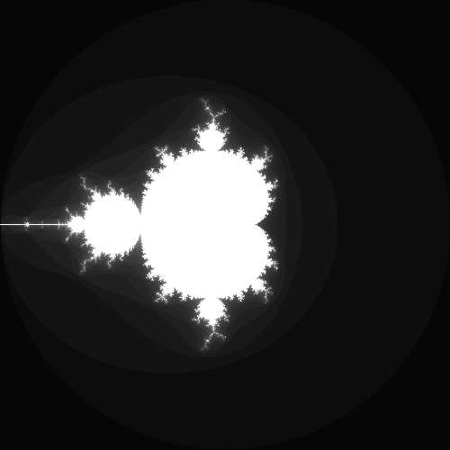](./output/fractal.png)

## ⭐⭐⭐(⭐) Dégradés dans l'espace de couleur Lab

```cpp
#include <sil/sil.hpp>
#include <cmath>
#include <iostream>

struct Lab {float L; float a; float b;};
struct RGB {float r; float g; float b;};

RGB oklab_to_linear_srgb(Lab c)
{
    float l_ = c.L + 0.3963377774f * c.a + 0.2158037573f * c.b;
    float m_ = c.L - 0.1055613458f * c.a - 0.0638541728f * c.b;
    float s_ = c.L - 0.0894841775f * c.a - 1.2914855480f * c.b;

    float l = l_*l_*l_;
    float m = m_*m_*m_;
    float s = s_*s_*s_;

    return RGB{
		+4.0767416621f * l - 3.3077115913f * m + 0.2309699292f * s,
		-1.2684380046f * l + 2.6097574011f * m - 0.3413193965f * s,
		-0.0041960863f * l - 0.7034186147f * m + 1.7076147010f * s,
    };
}

/*
0 ≤ S ≤ 0.04045
===> L = S/12.92
0.04045 < S ≤ 1
===> L = ((S+0.055)/1.055)^2.4
*/
RGB linear_to_srgb(const RGB& linear) {
    RGB srgb;
    float channels[3] = {linear.r, linear.g, linear.b};
    for (int i = 0; i < 3; ++i) {
        float L = channels[i];
        if (L <= 0.0031308f) {
            channels[i] = L * 12.92f;
        } else {
            channels[i] = 1.055f * powf(L, 1.0f / 2.4f) - 0.055f;
        }
    }
    srgb.r = channels[0];
    srgb.g = channels[1];
    srgb.b = channels[2];
    return srgb;
}

int main()
{
    sil::Image lab_srgb{300, 200};
    auto lab_lrgb = lab_srgb;

    const Lab red_lab = Lab{0.628, 0.225, 0.126};
    const Lab green_lab = Lab{0.866, -0.234, 0.179};

    for (int x{0}; x < lab_srgb.width(); ++x)
    {
        for (int y{0}; y < lab_srgb.height(); ++y)
        {
            float rx = static_cast<float>(x) / static_cast<float>(lab_srgb.width() - 1);
            Lab lab_c =
            Lab{
                red_lab.L + rx * (green_lab.L - red_lab.L),
                red_lab.a + rx * (green_lab.a - red_lab.a),
                red_lab.b + rx * (green_lab.b - red_lab.b)
            };
            //1 : to linear
            RGB linear_c = oklab_to_linear_srgb(lab_c);

            lab_lrgb.pixel(x, y) = glm::vec3{
                linear_c.r,linear_c.g,linear_c.b
            };
            //2 : to sRGB
            RGB srgb_c = linear_to_srgb(linear_c);

            lab_srgb.pixel(x, y) = glm::vec3{
                srgb_c.r,srgb_c.g,srgb_c.b
            };
        }
    }
    lab_srgb.save("output/lab_as_srgb.png");
}
```

[](./output/lab_as_srgb.png)

## ⭐⭐⭐(⭐) Tramage

```cpp
#include <sil/sil.hpp>
#include <cmath>
#include <vector>

using bayerT = std::vector<std::vector<float>>;

bayerT generateBayerLevel(int n) {
    if (n == 1) {
        //bayer at level 0
        return {
            { -0.5f,  0.5f },
            {  1.5f, -1.5f }
        };
    }

    bayerT prev = generateBayerLevel(n - 1);
    int size = prev.size();
    int newSize = size * 2;

    bayerT result(newSize, std::vector<float>(newSize));

    for (int y = 0; y < size; ++y) {
        for (int x = 0; x < size; ++x) {
            float v = prev[y][x];

            //recursion
            result[y][x] = 4.0f * v + 0.0f;
            result[y][x + size] = 4.0f * v + 2.0f;
            result[y + size][x] = 4.0f * v + 3.0f;
            result[y + size][x + size] = 4.0f * v + 1.0f;
        }
    }

    return result;
}

int main() {
    //config
    float trs = 0.675f; //threshold shift [0;1] (the higher, the darker)
    int level = 2; //bayer level

    //1 : grayscale with sqrt(r^2 + g^2 + b^2)
    sil::Image image{"images/photo.jpg"};
    for (glm::vec3& color : image.pixels())
    {
        float c = color.r * 0.3 + color.g * 0.59 + color.b * 0.11;

        color = glm::vec3{c};
    }

    //2 : dithering
    const auto bayer = generateBayerLevel(level);
    float maxB = pow(bayer.size(), 2);

    for (int x = 0; x < image.width(); ++x)
    {
        for (int y = 0; y < image.height(); ++y) {

            const float brt = image.pixel(x,y).r;

            //bayer value
            float b = bayer[y % bayer.size()][x % bayer.size()];
            b = (b + 0.5f) / maxB; //normalize to [0,1]

            const float c = brt > trs - b
                ? 1.0
                : 0.0;

            image.pixel(x,y) = glm::vec3{c};
        }

    }

    image.save("output/dithering.png");
}
```

[](./output/dithering.png)

## ⭐⭐⭐(⭐) Normalisation de l'histogramme

```cpp
#include <sil/sil.hpp>
/* https://aampe.com/blog/how-to-normalize-data-in-excel */

int main()
{
    sil::Image image{"images/photo_faible_contraste.jpg"};

    glm::vec3 brightest{0.f};
    glm::vec3 darkest{1.f};

    //first : find brightest and darkest colors
    for (glm::vec3& color : image.pixels())
    {
        if (glm::any(glm::greaterThanEqual(color, brightest)))
            brightest = glm::max(brightest, color);
        if (glm::any(glm::lessThanEqual(color, darkest)))
            darkest = glm::min(darkest, color);
    }

    //second : histogram normalization
    for (glm::vec3& color : image.pixels())
    {
        auto c = (color - darkest)/(brightest-darkest);
        color = c;
    }
    image.save("output/histogram.png");
}
```

[](./output/histogram.png)

## ⭐⭐⭐⭐ Vortex

```cpp
#include <sil/sil.hpp>
#include <glm/gtx/matrix_transform_2d.hpp>
#include <cmath>

using vec2 = glm::vec2;

vec2 rotated(vec2 point, vec2 center_of_rotation, float angle)
{
    return vec2{glm::rotate(glm::mat3{1.f}, angle) * glm::vec3{point - center_of_rotation, 0.f}} + center_of_rotation;
}

int main() {
    //config
    float maxAngle = (4*std::numbers::pi_v<float>); //the max angle a pixel can be rotate too (radians)

    sil::Image image{"images/logo.png"};
    auto vortex = image;

    vec2 center = vec2{
        image.width()/2,
        image.height()/2
    };

    const float maxDistance =
        glm::distance(vec2{0,0}, center);

    for (int x = 0; x < image.width(); ++x) {
        for (int y = 0; y < image.height(); ++y) {
            vec2 pos{float(x), float(y)};
            float d = glm::distance(pos, center);
            float r = d / maxDistance; //= the further the higher [0;1]
            float angle = maxAngle * r;

            //rotation
            vec2 rot = rotated(pos, center, angle);

            //clamp image bounds
            rot.x = glm::clamp(rot.x, 0.f, float(image.width() - 1));
            rot.y = glm::clamp(rot.y, 0.f, float(image.height() - 1));

            //assign the current one to the rotated pixel
            vortex.pixel(x, y) = image.pixel(int(rot.x), int(rot.y));
        }
    }

    vortex.save("output/vortex.png");
}
```

[](./output/vortex.png)

## ⭐⭐⭐⭐ Convolutions

```cpp
#include <sil/sil.hpp>

int main()
{
    sil::Image image{"images/logo.png"};
    auto base = image;

    //kernel
    float kernel[3][3] = {
        {0.0625,0.125,0.0625},
        {0.125,0.25,0.125},
        {0.0625,0.125,0.0625}
    };

    for (int x{0}; x < image.width(); ++x)
    {
        for (int y{0}; y < image.height(); ++y)
        {
            glm::vec3 new_color{0.0f};

            // apply the kernel
            for (int kx{-1}; kx <= 1; ++kx)
            {
                for (int ky{-1}; ky <= 1; ++ky)
                {
                    int sample_x = glm::clamp(x + kx, 0, image.width() - 1);
                    int sample_y = glm::clamp(y + ky, 0, image.height() - 1);
                    new_color += base.pixel(sample_x, sample_y) * kernel[kx + 1][ky + 1];
                }
            }

            image.pixel(x, y) = glm::clamp(new_color, 0.0f, 1.0f);
        }
    }
    image.save("output/convolution.png");
}
```

[](./output/convolution.png)

### ⭐ Netteté, Contours, etc.

```cpp
#include <sil/sil.hpp>

int main()
{
    sil::Image image{"images/logo.png"};
    auto base = image;

    //kernel
    float kernel[3][3] = {
        {-1,-1,-1},
        {-1,8,-1},
        {-1,-1,-1}
    };

    for (int x{0}; x < image.width(); ++x)
    {
        for (int y{0}; y < image.height(); ++y)
        {
            glm::vec3 new_color{0.0f};

            // apply the kernel
            for (int kx{-1}; kx <= 1; ++kx)
            {
                for (int ky{-1}; ky <= 1; ++ky)
                {
                    int sample_x = glm::clamp(x + kx, 0, image.width() - 1);
                    int sample_y = glm::clamp(y + ky, 0, image.height() - 1);
                    new_color += base.pixel(sample_x, sample_y) * kernel[kx + 1][ky + 1];
                }
            }

            image.pixel(x, y) = glm::clamp(new_color, 0.0f, 1.0f);
        }
    }
    image.save("output/contours.png");
}
```

[](./output/contours.png)

## ⭐⭐ Filtres séparables

```cpp
#include <sil/sil.hpp>

int main() {
    //config (for a kernel that blur, otherwise define the kernel directly and change n value)
    const int n = 16; //kernel size

    //define the kernel here
    float kernel[n][n];
    for (int i = 0; i < n; ++i)
        for (int j = 0; j < n; ++j)
            kernel[i][j] = 1.0f / (n * n);

    sil::Image image{"images/logo.png"};
    auto base = image; //result
    auto temp = image; //temp for x pass

    int w = image.width();
    int h = image.height();
    float kernelX[n];
    float kernelY[n];

    //separate kernel
    for (int j = 0; j < n; ++j) kernelX[j] = kernel[0][j];
    for (int i = 0; i < n; ++i) kernelY[i] = kernel[i][0] / kernelX[0];

    int halfn = n / 2;

    //x pass
    for (int y = 0; y < h; ++y) {
        for (int x = 0; x < w; ++x) {
            glm::vec3 sum(0.0f);
            for (int k = 0; k < n; ++k) {
                int sx = glm::clamp(x + k - halfn, 0, w - 1);
                sum += base.pixel(sx, y) * kernelX[k];
            }
            temp.pixel(x, y) = sum;
        }
    }

    //y pass
    for (int y = 0; y < h; ++y) {
        for (int x = 0; x < w; ++x) {
            glm::vec3 sum(0.0f);
            for (int k = 0; k < n; ++k) {
                int sy = glm::clamp(y + k - halfn, 0, h - 1);
                sum += temp.pixel(x, sy) * kernelY[k];
            }
            image.pixel(x, y) = glm::clamp(sum, 0.0f, 1.0f);
        }
    }

    image.save("output/separable_filters.png");
}
```

[](./output/separable_filters.png)

## ⭐⭐ Différence de gaussiennes

```cpp
#include <sil/sil.hpp>

sil::Image blur(sil::Image image, int n) {
    float kernel[n][n];
    for (int i = 0; i < n; ++i)
        for (int j = 0; j < n; ++j)
            kernel[i][j] = 1.0f / (n * n);

    auto base = image; //result
    auto temp = image; //temp for x pass

    int w = image.width();
    int h = image.height();
    float kernelX[n];
    float kernelY[n];

    //separate kernel
    for (int j = 0; j < n; ++j) kernelX[j] = kernel[0][j];
    for (int i = 0; i < n; ++i) kernelY[i] = kernel[i][0] / kernelX[0];

    int halfn = n / 2;

    //x pass
    for (int y = 0; y < h; ++y) {
        for (int x = 0; x < w; ++x) {
            glm::vec3 sum(0.0f);
            for (int k = 0; k < n; ++k) {
                int sx = glm::clamp(x + k - halfn, 0, w - 1);
                sum += base.pixel(sx, y) * kernelX[k];
            }
            temp.pixel(x, y) = sum;
        }
    }

    //y pass
    for (int y = 0; y < h; ++y) {
        for (int x = 0; x < w; ++x) {
            glm::vec3 sum(0.0f);
            for (int k = 0; k < n; ++k) {
                int sy = glm::clamp(y + k - halfn, 0, h - 1);
                sum += temp.pixel(x, sy) * kernelY[k];
            }
            image.pixel(x, y) = glm::clamp(sum, 0.0f, 1.0f);
        }
    }

    return image;
}

sil::Image diff(sil::Image const& a, sil::Image const& b,float τ) {
    int w = a.width();
    int h = a.height();
    sil::Image res(w, h);
    for (int y = 0; y < h; ++y) {
        for (int x = 0; x < w; ++x) {
            glm::vec3 d = a.pixel(x, y) - τ * b.pixel(x, y);
            res.pixel(x, y) = d;
        }
    }
    return res;
}

sil::Image grayscale(sil::Image image)
{
    for (glm::vec3& color : image.pixels())
    {
        float c = color.r * 0.3 + color.g * 0.59 + color.b * 0.11;
        color = glm::vec3{c};
    }
    return image;
}

int main() {
    float T = 0.035f;  // threshold (lower = more edges)
    float τ = 0.95f; // scalar
    int σ = 5; // base blur radius
    int k = 2; // second blur scale factor

    sil::Image image("images/photo.jpg");

    //grayscale (because acerola cheated)
    image = grayscale(image);

    auto blurred_1 = blur(image, σ);
    auto blurred_2 = blur(image, k * σ);

    auto jungle_diff = diff(blurred_1, blurred_2, τ);

    for (int y = 0; y < jungle_diff.height(); ++y) {
        for (int x = 0; x < jungle_diff.width(); ++x) {
            jungle_diff.pixel(x, y) =
                jungle_diff.pixel(x, y).r > T ?
                    glm::vec3(0.0f) : glm::vec3(1.0f);
        }
    }

    jungle_diff.save("output/gaussians_diff.png");
}
```

[](./output/gaussians_diff.png)

## ⭐⭐⭐⭐⭐ K-means : trouver les couleurs les plus présentes dans une image

```cpp
#include <sil/sil.hpp>
#include <glm/glm.hpp>
#include <vector>
#include <cmath>
#include "random.hpp"

//based on https://www.geeksforgeeks.org/machine-learning/k-means-clustering-introduction/
int main()
{
    sil::Image image{"images/photo.jpg"};
    auto base = image;
    //config
    const int k = 16; //number of centroids (colors)
    const int max_iters = 10; //how much tries to update centroids (high = more accurate)

    const int w = image.width();
    const int h = image.height();

    //pick initialize k random centroids
    std::vector<glm::vec3> centroids(k);
    for (int i = 0; i < k; ++i)
    {
        int x = random_int(0, w - 1);
        int y = random_int(0, h - 1);
        centroids[i] = base.pixel(x, y);
    }

    //iterate k-means until max_iters
    for (int iter = 0; iter < max_iters; ++iter)
    {
        std::vector<glm::vec3> sums(k, glm::vec3{0.f});
        std::vector<int> counts(k, 0);

        //pixels assigned to closest centroid
        for (int y = 0; y < h; ++y)
        for (int x = 0; x < w; ++x)
        {
            glm::vec3 c = base.pixel(x, y);
            float minDist = sqrt(3.f);  //max distance is (1,1,1) to (0,0,0)
            int best = 0;
            for (int i = 0; i < k; ++i)
            {
                float d = glm::distance(c, centroids[i]);
                if (d < minDist)
                {
                    minDist = d;
                    best = i;
                }
            }
            sums[best] += c;
            counts[best] += 1;
        }

        //update centroids
        for (int i = 0; i < k; ++i)
            if (counts[i] > 0)
                centroids[i] = sums[i] / float(counts[i]);
    }

    //recolor image using nearest centroid
    for (int y = 0; y < h; ++y)
    for (int x = 0; x < w; ++x)
    {
        glm::vec3 c = base.pixel(x, y);
        float minDist = std::numeric_limits<float>::max();
        int best = 0;
        for (int i = 0; i < k; ++i)
        {
            float d = glm::distance(c, centroids[i]);
            if (d < minDist)
            {
                minDist = d;
                best = i;
            }
        }
        image.pixel(x, y) = centroids[best];
    }

    image.save("output/kmeans.png");
}
```

[](./output/kmeans.png)

## ⭐⭐⭐⭐⭐ Filtre de Kuwahara (effet peinture à l'huile)

```cpp
#include <sil/sil.hpp>
#include <array>

int main()
{
    sil::Image image{"images/photo.jpg"};
    auto base = image;

    for (int x = 0; x < image.width(); ++x)
    {
        for (int y = 0; y < image.height(); ++y)
        {
            std::array<glm::vec3, 4> regions{
                glm::vec3{0.f}, glm::vec3{0.f}, glm::vec3{0.f}, glm::vec3{0.f}
            };
            std::array<float, 4> counts{
                0.f, 0.f, 0.f, 0.f
            };

            //mean accumulation on 5x5 (-2 to 2 based on center)
            for (int kx = -2; kx <= 2; ++kx)
            {
                for (int ky = -2; ky <= 2; ++ky)
                {
                    int sx = glm::clamp(x + kx, 0, image.width() - 1);
                    int sy = glm::clamp(y + ky, 0, image.height() - 1);
                    glm::vec3 c = base.pixel(sx, sy);

                    int r =
                        (kx <= 0 && ky <= 0) ?
                            0 : (kx >  0 && ky <= 0) ?
                                1 : (kx <= 0 && ky >  0) ?
                                    2 : 3;

                    regions[r] += c; //+color
                    counts[r]  += 1.f; //+1 count
                }
            }

            std::array<glm::vec3, 4> means;
            for (int i = 0; i < 4; ++i)
                means[i] = regions[i] / counts[i];

            std::array<float, 4> dev{0.f, 0.f, 0.f, 0.f};

            //deviation (https://www.geeksforgeeks.org/maths/standard-deviation-formula/)
            for (int kx = -2; kx <= 2; ++kx)
            {
                for (int ky = -2; ky <= 2; ++ky)
                {
                    int r =
                        (kx <= 0 && ky <= 0) ? 0 :
                        (kx >  0 && ky <= 0) ? 1 :
                        (kx <= 0 && ky >  0) ? 2 : 3;

                    int sx = glm::clamp(x + kx, 0, image.width() - 1);
                    int sy = glm::clamp(y + ky, 0, image.height() - 1);
                    glm::vec3 c = base.pixel(sx, sy);

                    dev[r] += glm::distance(c, means[r]);
                }
            }

            //select smallest dev (= result)
            float minDev = sqrt(3.f);
            glm::vec3 res = image.pixel(x, y);

            for (int i = 0; i < 4; ++i)
            {
                dev[i] /= counts[i];

                if (dev[i] < minDev)
                {
                    minDev = dev[i];
                    res = means[i];
                }
            }

            image.pixel(x, y) = res;
        }
    }

    image.save("output/kuwahara.png");
}
```

[](./output/kuwahara.png)

## ⭐⭐⭐⭐⭐⭐ Diamond Square

```cpp
#include <sil/sil.hpp>
#include "random.hpp"
#include <array>
#include <cmath>

//config (you can change these)
const int n = 8;
const float hMin = 1.0f;
const float hMax = 8.0f;

//globals (don't touch)
float mapMin = 0;
float mapMax = 0;
const int mapSize = pow(2, n) + 1;
using arrayT = std::array<std::array<float, mapSize>, mapSize>;

void fillArr(arrayT& arr, float value) {
    for (auto& row : arr) {
        for (auto& item : row) {
            item = value;
        }
    }
}

void updateMapMinMax(float value) {
    if (value < mapMin) {
        mapMin = value;
    }
    if (value > mapMax) {
        mapMax = value;
    }
}

/////////////////////////////////////

void square_step(arrayT& arr, int size, int half, float r) {
    for (int iy = 0; iy < mapSize - 1; iy += size) {
        for (int ix = 0; ix < mapSize - 1; ix += size) {
            float x = arr[iy][ix]; //TL
            updateMapMinMax(x);
            float y = arr[iy][ix + size]; //TR
            updateMapMinMax(y);
            float z = arr[iy + size][ix]; //BL
            updateMapMinMax(z);
            float w = arr[iy + size][ix + size]; //BR
            updateMapMinMax(w);
            float c = (x + y + z + w) / 4; //C
            c += random_float(-r, r);
            updateMapMinMax(c);
            arr[iy + half][ix + half] = c;
        }
    }
}

void diamond_step(arrayT& arr, int size, int half, float r) {
    for (int iy = 0; iy < mapSize; iy += half) {
        for (int ix = (iy + half) % size; ix < mapSize; ix += size) {
            int count = 0;
            float sum = 0;

            //T
            if (iy - half >= 0) {
                sum += arr[iy - half][ix];
                count++;
            }
            //L
            if (ix - half >= 0) {
                sum += arr[iy][ix - half];
                count++;
            }
            //R
            if (ix + half < mapSize) {
                sum += arr[iy][ix + half];
                count++;
            }
            //B
            if (iy + half < mapSize) {
                sum += arr[iy + half][ix];
                count++;
            }

            float c = sum / count;
            c += random_float(-r, r);
            updateMapMinMax(c);
            arr[iy][ix] = c;
        }
    }
}

arrayT diamond_square_algorithm(float r) {
    arrayT height_map = {};
    fillArr(height_map, 0);

    //corners
    height_map[0][0] = random_float(hMin, hMax);
    height_map[0][mapSize - 1] = random_float(hMin, hMax);
    height_map[mapSize - 1][0] = random_float(hMin, hMax);
    height_map[mapSize - 1][mapSize - 1] = random_float(hMin, hMax);

    int chunk_size = mapSize - 1;

    while (chunk_size > 1) {
        int half = chunk_size / 2;
        square_step(height_map, chunk_size, half, r);
	    diamond_step(height_map, chunk_size, half, r);
        chunk_size /= 2;
        r /= 2;
    }
    return height_map;
}

int main() {
    sil::Image image{mapSize, mapSize};

    arrayT res = diamond_square_algorithm(8.0f);

    for (int y = 0; y < mapSize; ++y) {
        for (int x = 0; x < mapSize; ++x) {
            float& v = res[y][x];
            v = (v - mapMin) / (mapMax - mapMin);
            image.pixel(x, y) = glm::vec3{v, v, v};
        }
    }
    image.save("output/diamond.png");
}
```

[](./output/diamond.png)

### ⭐⭐ Colorer la height map

```cpp
#include <sil/sil.hpp>
#include "random.hpp"
#include <array>
#include <cmath>

//config (you can change these)
const int n = 8;
const float hMin = 1.0f;
const float hMax = 8.0f;
//color1 -> color2 |/| color3 -> color4
const glm::vec3 color1 = glm::vec3{0.f, 0.f, 0.2f}; //dark blue
const glm::vec3 color2 = glm::vec3{0.f, 0.f, 1.f}; //blue
const glm::vec3 color3 = glm::vec3{0.f, 1.f, 0.f}; //green
const glm::vec3 color4 = glm::vec3{0.f, 0.2f, 0.f}; //dark green
const float tr2_3 = 0.5f; //between color2 and color3

//globals (don't touch)
float mapMin = 0;
float mapMax = 0;
const int mapSize = pow(2, n) + 1;
using arrayT = std::array<std::array<float, mapSize>, mapSize>;

void fillArr(arrayT& arr, float value) {
    for (auto& row : arr) {
        for (auto& item : row) {
            item = value;
        }
    }
}

void updateMapMinMax(float value) {
    if (value < mapMin) {
        mapMin = value;
    }
    if (value > mapMax) {
        mapMax = value;
    }
}

/////////////////////////////////////

void square_step(arrayT& arr, int size, int half, float r) {
    for (int iy = 0; iy < mapSize - 1; iy += size) {
        for (int ix = 0; ix < mapSize - 1; ix += size) {
            float x = arr[iy][ix]; //TL
            updateMapMinMax(x);
            float y = arr[iy][ix + size]; //TR
            updateMapMinMax(y);
            float z = arr[iy + size][ix]; //BL
            updateMapMinMax(z);
            float w = arr[iy + size][ix + size]; //BR
            updateMapMinMax(w);
            float c = (x + y + z + w) / 4; //C
            c += random_float(-r, r);
            updateMapMinMax(c);
            arr[iy + half][ix + half] = c;
        }
    }
}

void diamond_step(arrayT& arr, int size, int half, float r) {
    for (int iy = 0; iy < mapSize; iy += half) {
        for (int ix = (iy + half) % size; ix < mapSize; ix += size) {
            int count = 0;
            float sum = 0;

            //T
            if (iy - half >= 0) {
                sum += arr[iy - half][ix];
                count++;
            }
            //L
            if (ix - half >= 0) {
                sum += arr[iy][ix - half];
                count++;
            }
            //R
            if (ix + half < mapSize) {
                sum += arr[iy][ix + half];
                count++;
            }
            //B
            if (iy + half < mapSize) {
                sum += arr[iy + half][ix];
                count++;
            }

            float c = sum / count;
            c += random_float(-r, r);
            updateMapMinMax(c);
            arr[iy][ix] = c;
        }
    }
}

arrayT diamond_square_algorithm(float r) {
    arrayT height_map = {};
    fillArr(height_map, 0);

    //corners
    height_map[0][0] = random_float(hMin, hMax);
    height_map[0][mapSize - 1] = random_float(hMin, hMax);
    height_map[mapSize - 1][0] = random_float(hMin, hMax);
    height_map[mapSize - 1][mapSize - 1] = random_float(hMin, hMax);

    int chunk_size = mapSize - 1;

    while (chunk_size > 1) {
        int half = chunk_size / 2;
        square_step(height_map, chunk_size, half, r);
	    diamond_step(height_map, chunk_size, half, r);
        chunk_size /= 2;
        r /= 2;
    }
    return height_map;
}

int main() {
    sil::Image image{mapSize, mapSize};

    arrayT res = diamond_square_algorithm(8.0f);

    for (int y = 0; y < mapSize; ++y) {
        for (int x = 0; x < mapSize; ++x) {
            float& v = res[y][x];
            v = (v - mapMin) / (mapMax - mapMin);

            //coloring
            v = std::round(v / 0.1f) * 0.1f;//rounding to have less smooth colors
            glm::vec3 color;

            if (v > tr2_3) {
                color = glm::mix(color3, color4, v);
            } else {
                color = glm::mix(color1, color2, v);
            }

            image.pixel(x, y) = color;
        }
    }
    image.save("output/diamond_square_color.png");
}
```

[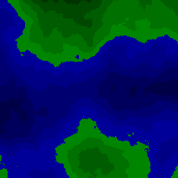](./output/diamond_color.png)

# Custom

## ⭐ Différence

```cpp
sil::Image diff(sil::Image const& a, sil::Image const& b) {

    if (a.width() < b.width() || a.height() < b.height()) {
        throw std::runtime_error("the second image must be smaller (or equal) in size to the first one");
    }

    int w = a.width();
    int h = a.height();
    sil::Image res(w, h);
    for (int y = 0; y < h; ++y) {
        for (int x = 0; x < w; ++x) {
            res.pixel(x, y) = glm::abs(a.pixel(x, y) - b.pixel(x, y));
        }
    }
    return res;
}
```

La différence de ces deux images

[](./images/photo.jpg)
[](./images/photo_faible_contraste.jpg)

donne

[](./output/diff.png)

## ⭐⭐ Animation Cercle Hachuré

```cpp
#include <sil/sil.hpp>
#include <cmath>
#include <string>

int main()
{
    int r = 100;
    int tr = 10; // threshold
    int spf = 10; // speed per frame

    for (int a = 0; a < 500; a+=spf) {

        sil::Image image{500, 500};
        int b = image.height() / 2;

        for (int x{0}; x < image.width(); x += tr)
        {
            for (int y{0}; y < image.height(); ++y)
            {
                int dx = x - a;
                int dy = y - b;
                if (dx*dx + dy*dy <= r * r) {
                    image.pixel(x,y) = glm::vec3 {1.0f,1.0f,1.0f};
                }
            }
        }

        auto fileName = "output/hatched_animated_circle/" + std::to_string(a/spf) + ".png";
        image.save(fileName);
    }
}
```

[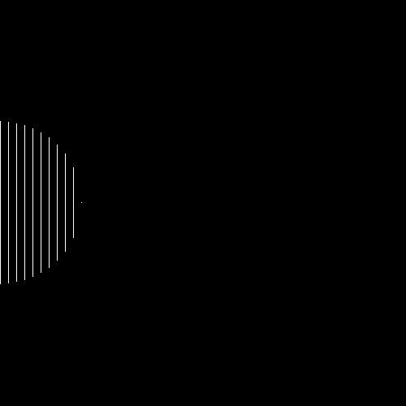](./output/hatched_animated_circle/ezgif.gif)

## ⭐⭐⭐ Colorer la height map selon une image de dégradé

```cpp
#include <sil/sil.hpp>
#include "random.hpp"
#include <array>
#include <cmath>
#include <iostream>

//config (you can change these)
const int n = 8;
const float hMin = 1.f;
const float hMax = 8.f;

//globals (don't touch)
float mapMin = 0.f;
float mapMax = 0.f;
const int mapSize = pow(2, n) + 1;
using arrayT = std::array<std::array<float, mapSize>, mapSize>;

void fillArr(arrayT& arr, float value) {
    for (auto& row : arr) {
        for (auto& item : row) {
            item = value;
        }
    }
}

void updateMapMinMax(float value) {
    if (value < mapMin) {
        mapMin = value;
    }
    if (value > mapMax) {
        mapMax = value;
    }
}

/////////////////////////////////////

void square_step(arrayT& arr, int size, int half, float r) {
    for (int iy = 0; iy < mapSize - 1; iy += size) {
        for (int ix = 0; ix < mapSize - 1; ix += size) {
            float x = arr[iy][ix]; //TL
            updateMapMinMax(x);
            float y = arr[iy][ix + size]; //TR
            updateMapMinMax(y);
            float z = arr[iy + size][ix]; //BL
            updateMapMinMax(z);
            float w = arr[iy + size][ix + size]; //BR
            updateMapMinMax(w);
            float c = (x + y + z + w) / 4; //C
            c += random_float(-r, r);
            updateMapMinMax(c);
            arr[iy + half][ix + half] = c;
        }
    }
}

void diamond_step(arrayT& arr, int size, int half, float r) {
    for (int iy = 0; iy < mapSize; iy += half) {
        for (int ix = (iy + half) % size; ix < mapSize; ix += size) {
            int count = 0;
            float sum = 0;

            //T
            if (iy - half >= 0) {
                sum += arr[iy - half][ix];
                count++;
            }
            //L
            if (ix - half >= 0) {
                sum += arr[iy][ix - half];
                count++;
            }
            //R
            if (ix + half < mapSize) {
                sum += arr[iy][ix + half];
                count++;
            }
            //B
            if (iy + half < mapSize) {
                sum += arr[iy + half][ix];
                count++;
            }

            float c = sum / count;
            c += random_float(-r, r);
            updateMapMinMax(c);
            arr[iy][ix] = c;
        }
    }
}

arrayT diamond_square_algorithm(float r) {
    arrayT height_map = {};
    fillArr(height_map, 0);

    //corners
    height_map[0][0] = random_float(hMin, hMax);
    height_map[0][mapSize - 1] = random_float(hMin, hMax);
    height_map[mapSize - 1][0] = random_float(hMin, hMax);
    height_map[mapSize - 1][mapSize - 1] = random_float(hMin, hMax);

    int chunk_size = mapSize - 1;

    while (chunk_size > 1) {
        int half = chunk_size / 2;
        square_step(height_map, chunk_size, half, r);
	    diamond_step(height_map, chunk_size, half, r);
        chunk_size /= 2;
        r /= 2;
    }
    return height_map;
}

int main() {
    sil::Image image{mapSize, mapSize};
    sil::Image color_map{"images/color_map.png"};
    float pre = 1.f / color_map.width();

    arrayT res = diamond_square_algorithm(8.0f);

    for (int y = 0; y < mapSize; ++y) {
        for (int x = 0; x < mapSize; ++x) {
            float& v = res[y][x];
            v = (v - mapMin) / (mapMax - mapMin);

            //coloring
            v = std::round(v / pre) * pre;//rounding
            glm::vec3 color;

            int color_x = static_cast<int>(v*color_map.width())-1;
            if (color_x < 0.f) {
                color_x = 0.f;
            } else if (color_x >= color_map.width()) {
                color_x = color_map.width() - 1;
            }
            color = color_map.pixel(color_x, 0);

            image.pixel(x, y) = color;
        }
    }
    image.save("output/diamond_color_map.png");
}
```

[](./output/diamond_color_map.png)

### ⭐⭐ Height map stylisée

```cpp
#include <sil/sil.hpp>
#include "random.hpp"
#include <array>
#include <cmath>
#include <iostream>

//config (you can change these)
const int n = 9;
const float hMin = 1.f;
const float hMax = 8.f;
float alpha = 0.5f; //how much the dithering should affect the final image (%)
float trs = 0.675f; //threshold for dithering (high = brighter)
int level = 2; //dithering level

//globals (don't touch)
float mapMin = 0.f;
float mapMax = 0.f;
const int mapSize = pow(2, n) + 1;
using arrayT = std::array<std::array<float, mapSize>, mapSize>;
using bayerT = std::vector<std::vector<float>>;

bayerT generateBayerLevel(int n) {
    if (n == 1) {
        //bayer at level 0
        return {
            { -0.5f,  0.5f },
            {  1.5f, -1.5f }
        };
    }

    bayerT prev = generateBayerLevel(n - 1);
    int size = prev.size();
    int newSize = size * 2;

    bayerT result(newSize, std::vector<float>(newSize));

    for (int y = 0; y < size; ++y) {
        for (int x = 0; x < size; ++x) {
            float v = prev[y][x];

            //recursion
            result[y][x] = 4.0f * v + 0.0f;
            result[y][x + size] = 4.0f * v + 2.0f;
            result[y + size][x] = 4.0f * v + 3.0f;
            result[y + size][x + size] = 4.0f * v + 1.0f;
        }
    }

    return result;
}

sil::Image dithering(sil::Image image, float trs = 0.675f, int level = 2) {
    for (glm::vec3& color : image.pixels())
    {
        float c = color.r * 0.3 + color.g * 0.59 + color.b * 0.11;

        color = glm::vec3{c};
    }

    //2 : dithering
    const auto bayer = generateBayerLevel(level);
    float maxB = pow(bayer.size(), 2);

    for (int x = 0; x < image.width(); ++x)
    {
        for (int y = 0; y < image.height(); ++y) {

            const float brt = image.pixel(x,y).r;

            //bayer value
            float b = bayer[y % bayer.size()][x % bayer.size()];
            b = (b + 0.5f) / maxB; //normalize to [0,1]

            const float c = brt > trs - b
                ? 1.0
                : 0.0;

            image.pixel(x,y) = glm::vec3{c};
        }

    }

    return image;
}

/////////////////////////////////////

void fillArr(arrayT& arr, float value) {
    for (auto& row : arr) {
        for (auto& item : row) {
            item = value;
        }
    }
}

void updateMapMinMax(float value) {
    if (value < mapMin) {
        mapMin = value;
    }
    if (value > mapMax) {
        mapMax = value;
    }
}

void square_step(arrayT& arr, int size, int half, float r) {
    for (int iy = 0; iy < mapSize - 1; iy += size) {
        for (int ix = 0; ix < mapSize - 1; ix += size) {
            float x = arr[iy][ix]; //TL
            updateMapMinMax(x);
            float y = arr[iy][ix + size]; //TR
            updateMapMinMax(y);
            float z = arr[iy + size][ix]; //BL
            updateMapMinMax(z);
            float w = arr[iy + size][ix + size]; //BR
            updateMapMinMax(w);
            float c = (x + y + z + w) / 4; //C
            c += random_float(-r, r);
            updateMapMinMax(c);
            arr[iy + half][ix + half] = c;
        }
    }
}

void diamond_step(arrayT& arr, int size, int half, float r) {
    for (int iy = 0; iy < mapSize; iy += half) {
        for (int ix = (iy + half) % size; ix < mapSize; ix += size) {
            int count = 0;
            float sum = 0;

            //T
            if (iy - half >= 0) {
                sum += arr[iy - half][ix];
                count++;
            }
            //L
            if (ix - half >= 0) {
                sum += arr[iy][ix - half];
                count++;
            }
            //R
            if (ix + half < mapSize) {
                sum += arr[iy][ix + half];
                count++;
            }
            //B
            if (iy + half < mapSize) {
                sum += arr[iy + half][ix];
                count++;
            }

            float c = sum / count;
            c += random_float(-r, r);
            updateMapMinMax(c);
            arr[iy][ix] = c;
        }
    }
}

arrayT diamond_square_algorithm(float r) {
    arrayT height_map = {};
    fillArr(height_map, 0);

    //corners
    height_map[0][0] = random_float(hMin, hMax);
    height_map[0][mapSize - 1] = random_float(hMin, hMax);
    height_map[mapSize - 1][0] = random_float(hMin, hMax);
    height_map[mapSize - 1][mapSize - 1] = random_float(hMin, hMax);

    int chunk_size = mapSize - 1;

    while (chunk_size > 1) {
        int half = chunk_size / 2;
        square_step(height_map, chunk_size, half, r);
	    diamond_step(height_map, chunk_size, half, r);
        chunk_size /= 2;
        r /= 2;
    }
    return height_map;
}

sil::Image diamond_square() {
    sil::Image image{mapSize, mapSize};
    sil::Image color_map{"images/color_map.png"};
    float pre = 1.f / color_map.width();

    arrayT res = diamond_square_algorithm(8.0f);

    for (int y = 0; y < mapSize; ++y) {
        for (int x = 0; x < mapSize; ++x) {
            float& v = res[y][x];
            v = (v - mapMin) / (mapMax - mapMin);

            //coloring
            v = std::round(v / pre) * pre;//rounding
            glm::vec3 color;

            int color_x = static_cast<int>(v*color_map.width())-1;
            if (color_x < 0.f) {
                color_x = 0.f;
            } else if (color_x >= color_map.width()) {
                color_x = color_map.width() - 1;
            }
            color = color_map.pixel(color_x, 0);

            image.pixel(x, y) = color;
        }
    }
    return image;
}

int main() {
    sil::Image image = diamond_square();
    sil::Image dithered = dithering(image, trs, level); //dithered act as luminosity map
    for (int x = 0; x < image.width(); ++x) {
        for (int y = 0; y < image.height(); ++y) {

            glm::vec3 color = image.pixel(x, y);
            float d = dithered.pixel(x, y).r;
            image.pixel(x, y) = glm::mix(color, color * d, alpha);
        }
    }
    image.save("output/diamond_color_dithering.png");
}
```

[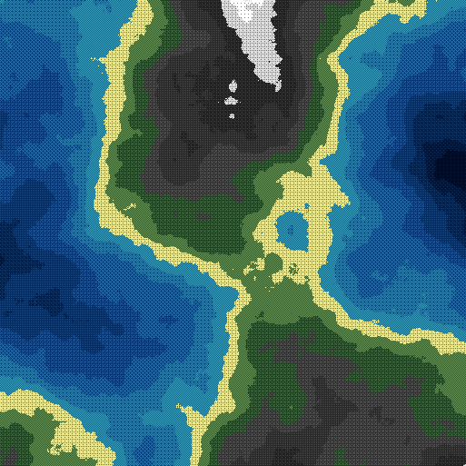](./output/diamond_color_dithering.png)
