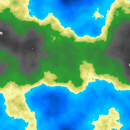

Superbe repo où on fait joujou avec des images

> ℹ️ le code de chaque exo se trouve dans [EXOS.md](./EXOS.md)

# Blabla

Le résultat de l'exercice custom [⭐⭐ Animation Cercle Hachuré](./EXOS.md#-animation-cercle-hachuré) est due à une erreur où j'ai ajouté une valeur à la mauvaise variable.

Résultat, j'ai incrémenté les x des pixels de 10 au lieu de la position du cercle ce qui fait cet effet hachuré

---

Pour l'exercice [ ⭐⭐⭐ Colorer la height map selon une image de dégradé](#-colorer-la-height-map-selon-une-image-de-dégradé) j'ai décidé de reprendre la coloration de la height_map mais de me baser sur une image qui contient un dégradé horizontal de couleur :

Qui permet de coloré les valeurs allant de 0 (couleur à gauche) à 1 (couleur à droite), ce qui donne :

