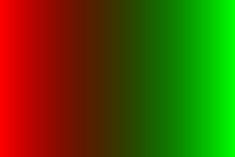

Superbe repo où on fait joujou avec des images

> ℹ️ le code de chaque exo se trouve dans [EXOS.md](./EXOS.md)

# Blabla

Le résultat de l'exercice custom [⭐⭐ Animation Cercle Hachuré](./EXOS.md#-animation-cercle-hachuré) est due à une erreur où j'ai ajouté une valeur à la mauvaise variable.

Résultat, j'ai incrémenté les x des pixels de 10 au lieu de la position du cercle ce qui fait cet effet hachuré

---

Pour l'exercice [⭐⭐⭐(⭐) Dégradés dans l'espace de couleur Lab](./EXO.md#-dégradés-dans-lespace-de-couleur-lab) le résultat du dégradé n'est pas pertinent puisque l'espace de couleur utilisé par la librairie sil est sRGB et donc les valeurs Lab sont interprété comme des sRGB

sRGB 

sRGB -> Linear RGB 

Linear RGB -> Oklab 

Oklab est bon en terme de perception uniforme de la couleurs par rapport à la luminosité contrairement à sRGB qui affiche des couleurs plus sombres dans certaines transitions.
